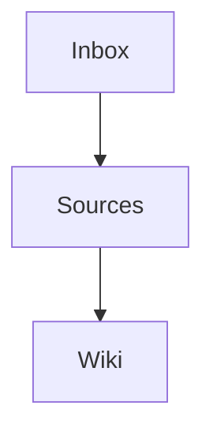

# Bloom

A living knowledge vault managed by Claude. You gather the raw material; Claude shapes it into a wiki of interconnected concepts, unresolved questions, and emergent themes.

Inspired by [Andrej Karpathy's LLM wiki pattern](https://x.com/karpathy/status/2039805659525644595): feed in unprocessed documents, and an LLM progressively distils them into concept articles with dense backlinks, turning the wiki into fertile ground for research and discovery.

## Quick start

1. **Clone this repo** and open it in [Obsidian](https://obsidian.md)
2. **Install Claude Code** — [claude.ai/code](https://claude.ai/code) (or whichever agent you prefer)
3. **Drop something into `inbox/`** — a URL, a web clipping (via [Obsidian Web Clipper](https://obsidian.md/clipper)), a PDF, or plain text
4. **Run `/bloom-ingest`** — Claude turns everything in the inbox into polished source notes
5. **Run `/bloom-compile`** — Claude hunts for themes that surface in two or more sources and assembles concept articles
6. **Run `/bloom-ask`** followed by a question — Claude investigates across the vault and drafts a report

That's the loop. Drop, ingest, compile. The vault compounds on its own.

## How it works

### Three layers

| Directory | Purpose | Who writes |
|---|---|---|
| `inbox/` | Landing zone for unprocessed material | You |
| `sources/` | Atomic notes — one per article, paper, or transcript | Claude |
| `wiki/` | Concept articles, people pages, query reports, index, and log | Claude |

### The contract

You decide what enters. Claude owns everything downstream. That boundary is deliberate — your judgement filters what deserves attention, while Claude handles the synthesis that would exhaust a human at scale.

### The 2-source rule

A single source is never enough for a concept. Themes are parked as **candidates** in `wiki/_meta/index.md` until another source independently corroborates them. This stops the wiki from bloating with half-baked ideas.

### What compounds

- **Sources** stack up as the raw substrate
- **Concepts** harden where patterns repeat
- **Queries** (`/bloom-ask`) generate research reports that are filed straight back into the wiki — so every question enriches the whole
- **Research threads** surface once three or more concepts cluster around the same keywords

## The four commands

| Command | What it does |
|---|---|
| `/bloom-ingest` | Turn inbox items into source notes |
| `/bloom-compile` | Forge or expand concept articles from un-compiled sources |
| `/bloom-ask` | Probe the vault with a question and write up the findings |
| `/bloom-lint` | Audit the vault: statistics, orphans, keyword drift |

## Companion vault (optional)

If you already maintain a personal notebook — a commonplace, Zettelkasten, or notes folder — you can link it as a read-only companion. Claude will weave references to your notes into its compilations but will never modify them. Check `AGENTS.md` for configuration.

## Customisation

- **Areas**: Tweak the `#area/` taxonomy in `CLAUDE.md` to reflect your own domains
- **Keywords**: Curated in `wiki/_meta/index.md` — expand the list as your reading deepens
- **Obsidian theme**: The bundled `.obsidian/` config is minimal. Swap themes or plugins freely
- **Voice**: Concept articles are deliberately framed as rough scaffolding for *your* prose, not final pieces. Change the voice guidance in `CLAUDE.md` if you want a different register

## What's included

The repo includes a set of sample notes so you can see the structure in action:

- `sources/HTTP Protocol for Backend Engineers.md` — a full source note on HTTP statelessness, methods, headers, and security
- `wiki/2026-05-04-what-is-http.md` — a query report answering "what is HTTP", referencing the source above
- `residuals/http.md` — the raw transcript that was ingested to produce the source note

Remove these and wipe `wiki/_meta/index.md` once you have the hang of it, or leave them as starting seeds for your own vault.

## Schema

Every operational rule Claude follows lives in `AGENTS.md`. Treat it as the canonical spec for the vault. Read it to understand the system, or edit it to bend the rules.

## Diagram support

Bloom renders diagrams with Mermaid. Any note can carry a `## Diagram` section containing an inline ` ```mermaid ``` ` block. Obsidian displays these out of the box — nothing extra to install.

Example:

```markdown
## Diagram


```

---

Built with [Claude Code](https://claude.ai/code) and [Obsidian](https://obsidian.md).
