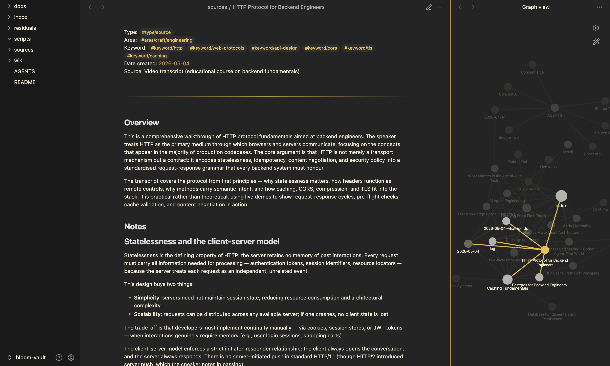

# Bloom

Bloom is an agent-run Obsidian vault.

You drop raw material into `inbox/`. An AI coding agent turns that material into durable source notes, compiles repeated ideas into wiki pages, answers research questions against the vault, and keeps the index, log, graph, and health files current.

The system follows Andrej Karpathy's LLM wiki pattern: keep raw sources separate from synthesized concepts, then let the derived layer become a searchable thinking surface. Bloom is not a chat transcript archive and not a folder of summaries. It is a working knowledge base that compounds through ingestion, citation, linking, and repeated synthesis.

## Quick Start

1. Open this repository as an Obsidian vault.
2. Use Codex, Claude Code, or another coding agent that can read `AGENTS.md`.
3. Drop raw material into `inbox/`: URLs, PDFs, transcripts, screenshots, clippings, or pasted text.
4. Ask the agent to run `/bloom-ingest`.
5. After several sources accumulate, ask for `/bloom-compile`.
6. Ask questions with `/bloom-ask <question>`.

The basic loop is:

```text
drop source -> ingest -> compile -> ask -> repeat
```

## The Core Contract

Bloom separates human judgment from agent maintenance.

You decide what deserves to enter the vault. The agent owns the downstream work: extracting sources, writing source notes, creating person pages, compiling concepts, updating metadata, and preserving links.

The important boundary is simple:

- `inbox/` is where you put unprocessed material.
- `sources/` contains atomic source notes produced from that material.
- `wiki/` contains synthesized pages, query reports, people pages, and vault metadata.
- `residuals/` stores processed originals and is treated as immutable.

If you connect a personal companion vault, Bloom may read from it and link into it, but must not write to it.

## Repository Layout

| Path | Purpose |
|---|---|
| `AGENTS.md` | Canonical operating spec for agents. Read this first. |
| `CLAUDE.md` | Claude-oriented copy or binding file when used with Claude Code. |
| `README.md` | Human-facing overview of the project. |
| `inbox/` | Staging area for unprocessed inputs. |
| `sources/` | Immutable source notes, one per article, paper, video, transcript, or other source. |
| `wiki/` | Concepts, query reports, session notes, people pages, and meta files. |
| `wiki/_meta/index.md` | Catalog, keyword glossary, research threads, open questions, prompts, and candidates. |
| `wiki/_meta/log.md` | Append-only chronological operation log. |
| `wiki/_meta/health.md` | Lint dashboard generated by `/bloom-lint`. |
| `wiki/_meta/graph.md` | Mermaid vault graph generated by `/bloom-graph`. |
| `residuals/` | Processed originals. Do not edit them. |
| `scripts/` | Fetching, paper cleaning, transcript, and graph helpers. |
| `docs/` | Supporting documentation assets. |

## Commands

These are natural-language commands handled by the agent according to `AGENTS.md`.

| Command | Result |
|---|---|
| `/bloom-ingest` | Process items in `inbox/` into source notes, update people/index/log, then move originals to `residuals/`. |
| `/bloom-compile` | Find source-backed themes and create or extend concept pages when the 2-source rule is met. |
| `/bloom-ask <question>` | Research across Bloom and write a cited query report into `wiki/`. |
| `/bloom-lint` | Audit stats, orphans, keyword drift, and candidates; overwrite `wiki/_meta/health.md`. |
| `/bloom-graph` | Generate a Mermaid connection graph in `wiki/_meta/graph.md`. |
| `/save <Title>` | Capture the current agent conversation as a narrative wiki page. |

## How Ingest Works

Ingest turns raw material into source notes that should be useful without revisiting the original.

Source notes are not thin summaries. A good source note reconstructs the argument, preserves distinctions, explains mechanisms, captures caveats, and links the source into the rest of the vault.

Special ingestion routes:

- YouTube URLs use `scripts/bloom-youtube.py` to fetch transcripts.
- ArXiv inputs prefer HTML via `scripts/bloom-paper.py`, preserving equations, figures, tables, methods, results, and limitations.
- General URLs use `scripts/bloom-fetch.py` with `trafilatura`.
- PDFs and pasted text can be processed directly from `inbox/`.

After ingest, the original file moves to `residuals/`. The source note remains in `sources/`.

## How Compile Works

Compile is deliberately conservative.

A concept page should not be created from a single source. Bloom waits for the same idea to appear across at least two independent sources, then creates or extends a concept page with traceable claims.

This keeps the wiki from becoming a graveyard of one-off summaries. Single-source themes go into Candidates in `wiki/_meta/index.md` until another source makes the pattern worth stabilizing.

Concept pages are scaffolds for future thinking:

- short, sharp definitions
- claim-shaped key points
- evidence across sources
- open questions
- prompts for essays or further research
- links to related concepts

## How Ask Works

`/bloom-ask` treats the vault as the research corpus.

The agent reads `wiki/_meta/index.md` first, searches relevant source and concept pages, writes a query report under `wiki/`, and updates metadata when the answer reveals new candidates, open questions, or prompts.

Answers should cite Bloom notes rather than inventing authority. If the vault does not know enough, the report should say so.

## Note Format

Bloom uses plain Markdown with plain key-value front matter. It is intentionally not YAML.

Example source note:

```markdown
Type: #type/source
Area: #area/craft/ai
Keyword: #keyword/knowledge-management #keyword/llms
Date created: [[2026-04-14]]
Source: https://example.com/article

---

## Overview

...
```

Every note gets exactly one `#type/` tag:

- `#type/source`
- `#type/concept`
- `#type/query`
- `#type/person`
- `#type/session`
- `#type/meta`

Keywords are curated in `wiki/_meta/index.md`. Reuse near-matches before creating new ones.

## Linking Rules

Bloom is link-first.

- Every concept claim should be traceable to source notes listed in `Sources:`.
- New concepts should link at least two related concepts when possible.
- People pages are connector nodes, not biographies.
- Diagrams use inline Mermaid blocks when they clarify a system, process, architecture, or taxonomy.
- Renames must update backlinks.

## Agent Instructions

`AGENTS.md` is the source of truth. If this README and `AGENTS.md` disagree, follow `AGENTS.md`.

Agents should:

- read `wiki/_meta/index.md` before answering vault questions
- never write to a companion vault
- never edit or delete files in `residuals/`
- avoid speculative concepts from one source
- update `wiki/_meta/index.md` and `wiki/_meta/log.md` after operations
- keep source notes dense enough to replace the original for future use

## Customization

Bloom is meant to be adapted.

Common changes:

- edit the `#area/` taxonomy in `AGENTS.md`
- tune the voice guidance for source notes and concept pages
- add or merge keywords in `wiki/_meta/index.md`
- connect a read-only companion vault
- adjust fetch scripts for your preferred source types

Keep the core separation intact: raw inputs, source notes, synthesized wiki, immutable residuals.

## Requirements

Bloom is just a Markdown vault plus scripts. Obsidian is optional but recommended.

Useful tools:

- an agent that follows repository instructions
- Python 3
- `uvx` for temporary Python script dependencies
- `trafilatura` for URL extraction
- `youtube-transcript-api` for YouTube transcript ingest

The scripts are called by the agent as needed; normal vault use does not require you to run them manually.

## Current State

This vault already contains source notes, concept pages, people pages, and generated metadata. To understand what is inside, start with:

- `wiki/_meta/index.md`
- `wiki/_meta/graph.md`
- `wiki/_meta/log.md`

Those files show the live catalog, graph, and operation history.

## Design Principle

Bloom should make research easier without pretending synthesis is free.

It keeps provenance visible, waits for repeated signal before forming concepts, and turns every good question back into a reusable wiki page. The goal is not to automate taste. The goal is to preserve your taste at the boundary of the system, then let the agent do the patient maintenance work around it.
